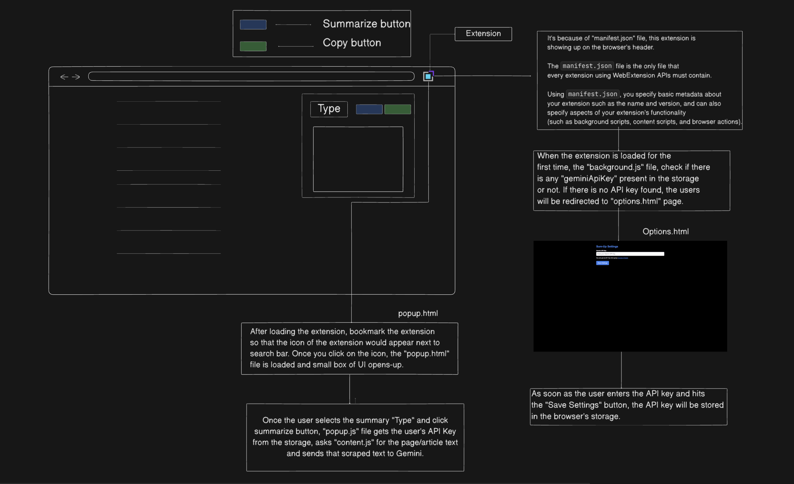
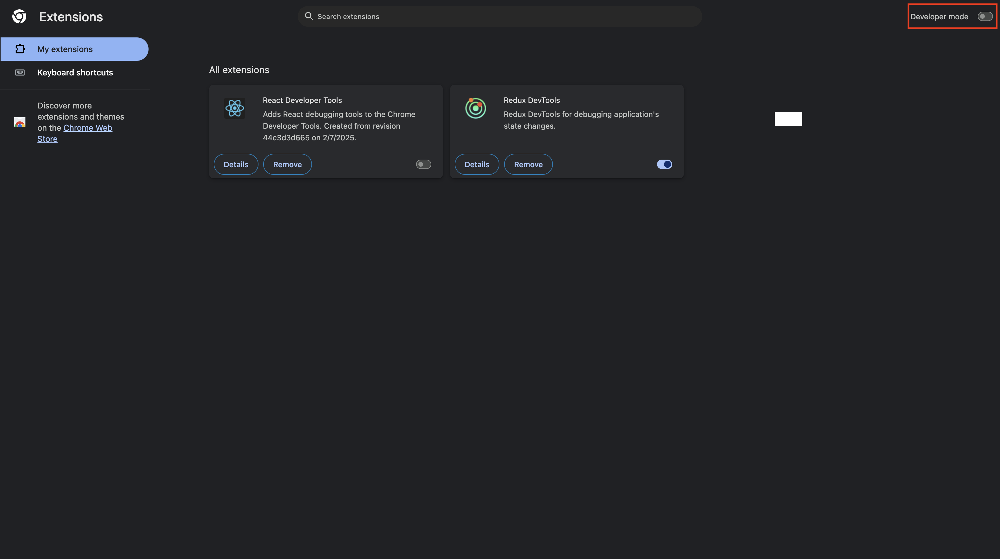
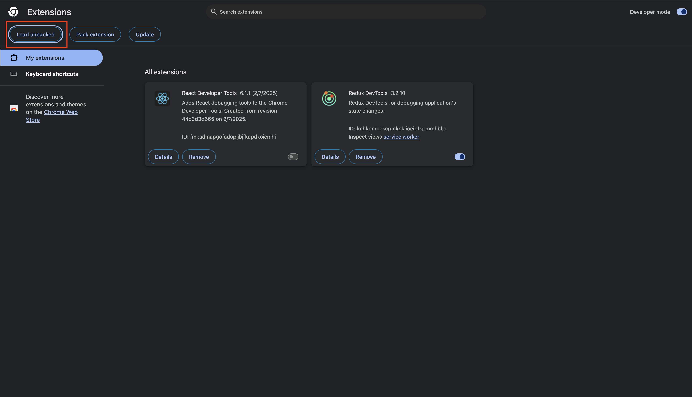
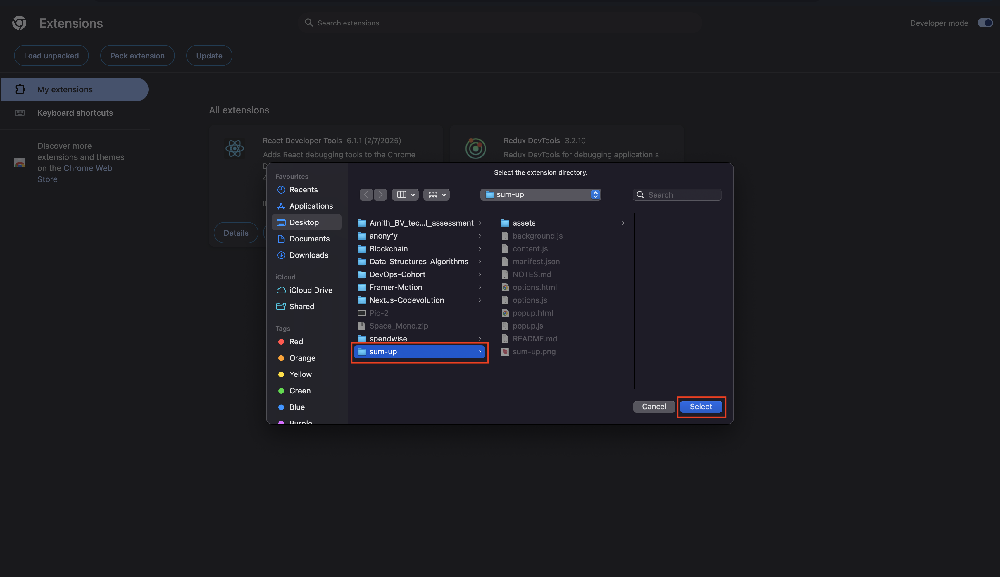
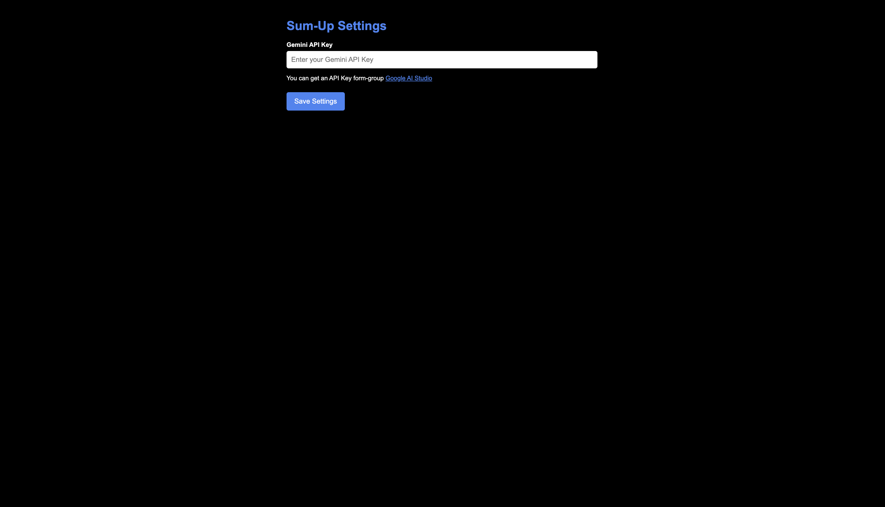
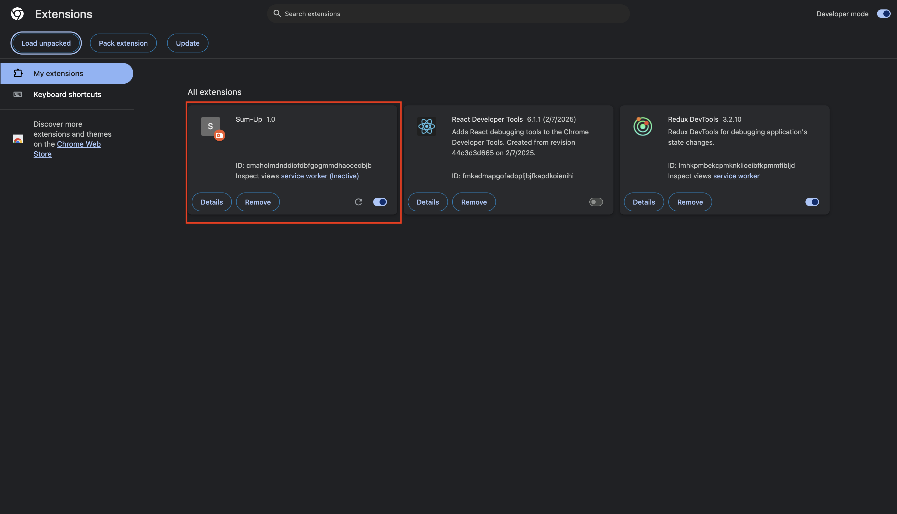
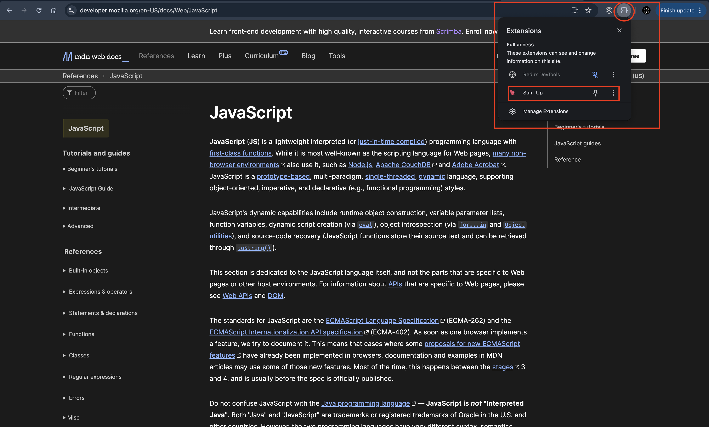
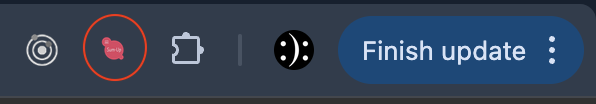
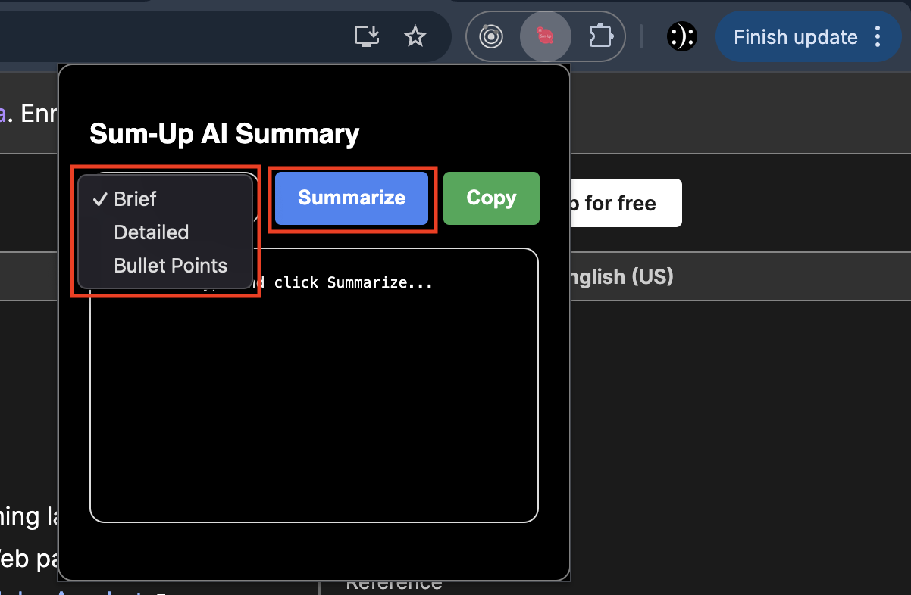
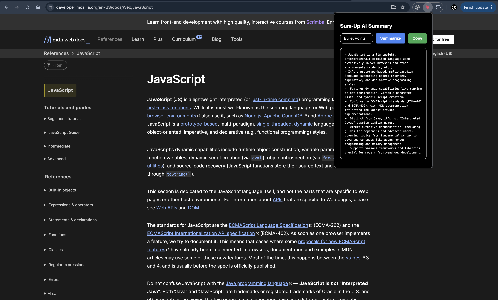

# Sum-Up - AI Article Summarizer Chrome Extension

**Sum-Up** is a lightweight Chrome Extension that instantly summarizes any article you're reading with the help of AI. Built with simple HTML, CSS, and JavaScript, Sum-Up offers users a clean, fast, and intuitive way to get the key points without reading the full content.

##

### Architecture :



##

### 🚀 Features : 

- ✨ **One-Click Summaries** : Instantly get a concise summary of any article.

- ⚡ **Minimal and Fast** : Lightweight design ensures smooth performance.

- 🎯 **Clean UI** : User-friendly and distraction-free interface.

- 🤖 **AI-Powered** : Leverages AI to provide smart, readable summaries.

- 🔒 **Privacy Friendly** : No unnecessary data collection.

##

### 📂 Project Structure

```bash
/sum-up/
│
├── assets/                # Folder for all the images used in README.md.
├── manifest.json          # Chrome Extension manifest file.
├── background.js          # This file checks for Gemini API Key.
├── options.html           # If Gemini API Key is not found this page will be rendered.
├── options.js             # Logic for options.html.

# When the extension is loaded and the icon is clicked

├── popup.html             # Main popup UI.
├── content.js             # For scraping the article.
├── popup.js               # Logic for fetching and displaying the summary.
└── README.md              # Project Documentation.

```

###

### 🛠️ How to Install (Locally) :

1. Clone or Download this repository :

```bash
clone https://github.com/AmithBV0606/Sum-Up.git
cd Sum-Up
```

2. Open Chrome and navigate to : 

```
chrome://extensions/
```

3. Enable/Toggle the Developer mode (top right corner) :

    

4. Click on "Load unpacked" :

    

5. Select the folder where you downloaded/cloned Sum-Up :

    

6. Then you'll be redirected to a page, where you have to enter your Gemini API Key :

    

7. The extension should now appear in your toolbar!

    

##

### 📋 Usage Instructions :

1. After successfully installing the extension, an icon should show up in your "Extension" list, then bookmark the Sum-Up chrome extension.

    

2. Click on the Sum-Up icon in your Chrome toolbar.

    

3. Select the type of summary you want and click the "Summarize" button.

    

4. Instantly get a short summary of the current webpage or article and read the summary directly from the popup.

    

##

### 🧩 Tech Stack :

- **HTML5** — Markup for the popup interface

- **CSS3** — Styling for the extension popup

- **JavaScript (Vanilla)** — Core logic for fetching and displaying summaries

- **Chrome Extensions API** — For interacting with the browser

##

### Built with ❤️ using simple web technologies.